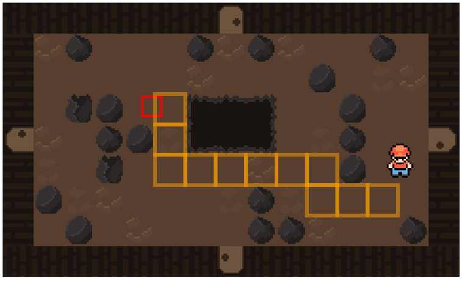
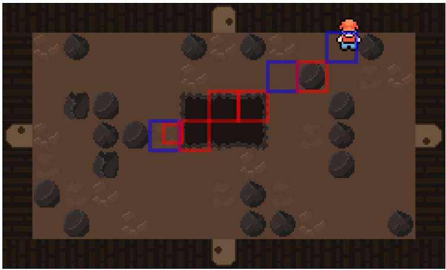

# Data Structures and Algorithms Exam - Pathfinding & Line of Sight

Controls: WASD  
Press Buttons in GUI to see visualization of algorithms  
Play here: https://nademtis.github.io/DSA-ML-exam/  

## About this project
This is a visualization of A* (Pathfinding algorithm) and Bresensham's Line Algorithm (Line of sight/raycast) set in a simple 2D game.  
Source code for algorithms can be found in [enemy.js](https://github.com/Nademtis/DSA-ML-exam/blob/main/Enemy.js) look for aStar() & calculateLineOfSight()  
A\* Algorithm (path to player)  
  
Bresenham's Line Algorithm (line of sight/raycast)  
  
